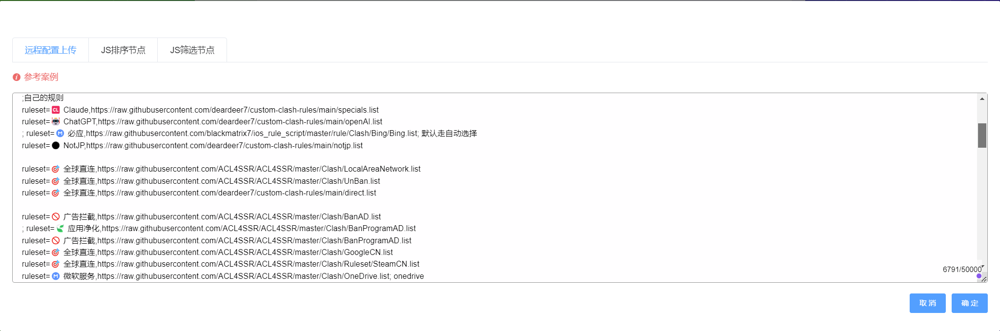
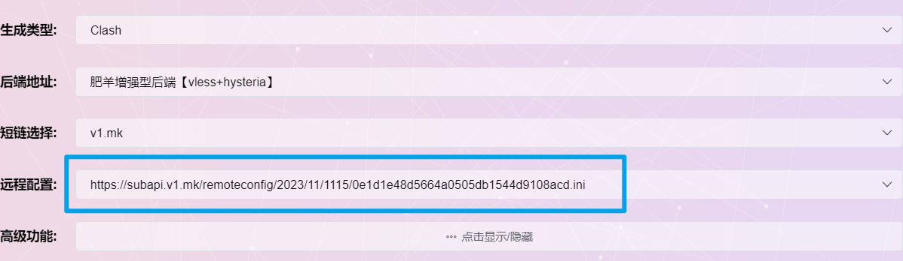
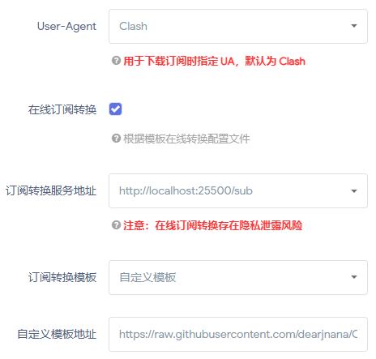

# 介绍
我的Clash规则

规则参考项目

https://github.com/ACL4SSR/ACL4SSR/tree/master

https://github.com/217heidai/adblockfilters

<details>
  
<summary>肥羊订阅转换</summary>

1. 以[肥羊订阅转换](https://suburl.v1.mk/)为例，进入转换界面，填入订阅链接（机场或自建）
2. 点击`自定义配置`
3. 同时打开仓库里面的“.ini”结尾的文件[地址](https://raw.githubusercontent.com/deardeer7/custom-clash-rules/main/custom%20rules.ini)，复制**文件内容**，粘贴到`远程配置文件上传`页面中
4. 检查`远程配置`，如图则成功
5. 根据自己偏好配置其他选项，生成订阅链接（ps: 网站支持自定义短链接后缀）
6. 导入clash即可~~
7. 
</details>

<details>

<summary>OpenClash使用方法</summary>
  
配合 subconverter_规则转换

项目地址

https://github.com/tindy2013/subconverter

docker-compose.yml
```ini
version: "3"
services:
  subconverter:
    image: tindy2013/subconverter:latest
    container_name: subconverter
    restart: unless-stopped
    ports:
      - "25500:25500" # Web界面和API服务的默认端口
    volumes:
      - ./config:/app/config # 挂载本地配置文件到容器中
    environment:
      - TZ=Asia/Shanghai # 设置时区为上海
```
docker-compose.yml 文件拖入目录后,SSH工具 cd 到 docker-compose.yml 所在目录.
执行

docker-compose up -d

容器运行后

http://localhost:25500/sub

就是本地规则转换服务地址

`如图设置`
  
</details>
更新方法:浏览器输入

/https://api.github.com/repos/{用户名}/{仓库名}/commits/{分支名}

我这个项目是输入下面

https://api.github.com/repos/dearjnana/ClashRule/commits/main

<!-- Trigger GitHub Pages Update -->
