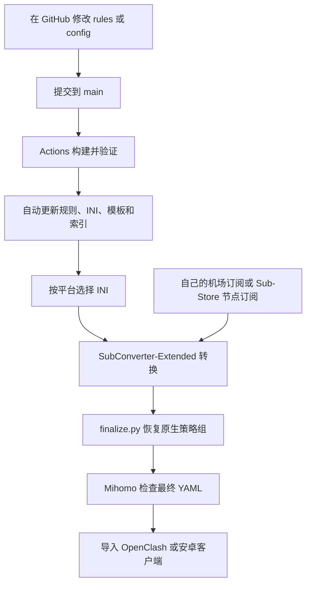

# ClashRule 使用与维护指南

本仓库维护 OpenClash 和 Clash Meta for Android 共用的分流规则、各自的订阅转换配置，以及相关容器部署示例。**在 GitHub 网页修改规则源并提交到 `main` 后，GitHub Actions 会自动构建、验证并更新仓库中的生成文件。**

首次使用先看下面的入口和接入步骤；日常只改规则时，直接看[网页修改流程](#web-edit)。[自动构建状态](https://github.com/dearjnana/ClashRule/actions/workflows/build.yml)可以查看最近一次修改是否通过验证。

## 目录

1. [OpenClash 与安卓分别使用哪个链接](#entry-links)
2. [从规则源到客户端的完整流程](#pipeline)
3. [首次接入与客户端使用](#client-setup)
4. [在 GitHub 修改规则并自动发布](#web-edit)
5. [策略组、规则顺序与两端差异](#routing)
6. [配置、构建结果和工具逐文件说明](#project-files)
7. [全部规则文件说明](#rule-files)
8. [部署示例、脚本和说明文档](#extras)
9. [常见问题与回退](#faq)
10. [本地开发与验证](#local-build)

<a id="entry-links"></a>

## 1. OpenClash 与安卓分别使用哪个链接

### 1.1 两个平台的转换配置入口

| 使用场景 | 应选择的文件 | 链接填在哪里 | 最后导入客户端的内容 |
| --- | --- | --- | --- |
| 路由器 OpenClash | [profiles/openclash.ini](profiles/openclash.ini) | 订阅转换器的“外部配置”或请求的 `config` 参数 | 含个人节点、完成整理的 OpenClash YAML |
| 安卓 Clash Meta for Android | [profiles/android.ini](profiles/android.ini) | 订阅转换器的“外部配置”或请求的 `config` 参数 | 含个人节点、完成整理的 Android YAML |
| 对照排查、验证展开规则 | [profiles/expanded.ini](profiles/expanded.ini) | 转换器的 `config` 参数 | 使用路由器基础设置的完整展开 YAML；不是手机专用入口 |

**OpenClash：复制这个地址到转换器的外部配置栏。**

```text
https://raw.githubusercontent.com/dearjnana/ClashRule/refs/heads/main/profiles/openclash.ini
```

**安卓手机：复制这个地址到转换器的外部配置栏。**

```text
https://raw.githubusercontent.com/dearjnana/ClashRule/refs/heads/main/profiles/android.ini
```

展开配置仅用于需要它的排查场景：

```text
https://raw.githubusercontent.com/dearjnana/ClashRule/refs/heads/main/profiles/expanded.ini
```

### 1.2 客户端最终导入哪个链接或文件

上面三个 `.ini` 是**转换配置入口**，不包含个人机场节点。GitHub 的文件浏览页面、`.list` 规则、`templates/*.yaml` 模板也都不能直接当成完整的个人订阅。

| 导入方式 | OpenClash | Clash Meta for Android |
| --- | --- | --- |
| 本地文件导入 | 导入使用 `openclash.ini` 转换、整理、验证后的文件，例如 `openclash-ready.yaml` | 导入使用 `android.ini` 转换、整理、验证后的文件，例如 `android-ready.yaml` |
| 订阅 URL 导入 | 使用你自己的服务提供的、返回完整 OpenClash YAML 的地址 | 使用你自己的服务提供的、返回完整 Android YAML 的地址 |

**本仓库没有公开的“含你个人节点的最终 YAML 订阅链接”。** 如果使用自己的订阅服务，该服务必须在每次更新时完成“订阅转换 → `finalize.py` 整理 → 返回完整 YAML”。仅把普通转换器的 `/sub` 地址填进客户端，不能替代整理步骤。当前仓库提供整理工具和转换配置，未提供自动整理服务。

两端使用同一份规则源，但建议分别生成和保存最终 YAML。手机外出时，订阅服务还需要能从移动网络访问；家庭局域网地址只能在相应网络内使用。

<a id="pipeline"></a>

## 2. 从规则源到客户端的完整流程


```mermaid
flowchart TD
    A[在 GitHub 修改 rules 或 config] --> B[提交到 main]
    B --> C[Actions 构建并验证]
    C --> D[自动更新规则、INI、模板和索引]
    D --> E[按平台选择 INI]
    E --> F[SubConverter-Extended 转换]
    S[自己的机场订阅或 Sub-Store 节点订阅] --> F
    F --> G[finalize.py 恢复原生策略组]
    G --> H[Mihomo 检查最终 YAML]
    H --> I[导入 OpenClash 或安卓客户端]
```

这里有两种“最终产物”：

- **仓库的公开产物**：`generated/rules/`、`providers/`、`profiles/`、`templates/` 和文件索引，由 Actions 自动更新。它们没有个人节点和订阅凭据。
- **你使用的个人配置**：公开产物与个人节点订阅组合后得到的完整 YAML，由你的转换和整理流程生成，再交给客户端。

GitHub 构建成功表示公开规则和配置验证通过，不会自动登录路由器、重启容器、修改手机设置或替换设备当前配置。普通网页修改不需要你在电脑上运行构建脚本；个人订阅的转换、整理和客户端更新是后续步骤。

<a id="client-setup"></a>

## 3. 首次接入与客户端使用

### 3.1 准备节点与转换器

1. 准备自己的机场订阅，或 Sub-Store 合并后导出的节点订阅。
2. 使用支持本仓库配置的 SubConverter-Extended。仓库自动测试固定使用 **SubConverter-Extended v1.9.7、Mihomo v1.19.31**；安卓适配记录为 **Clash Meta for Android v2.11.34**。这些是验证基线，不表示以后发布的版本都已测试。
3. 选择上面的 OpenClash 或 Android 外部配置链接。即使转换器已有默认配置，也要明确指定这里的 `config`：部署示例的默认外部配置不等于本仓库入口。
4. 如果使用机场名称筛选策略组，保留节点名称中的机场和地区标记。例如 Gemini 默认组需要同时识别 `MESL` 和美国标记。仅导入一串没有机场标记的节点，可能导致对应组为空。

Sub-Store 可负责合并、过滤和重命名节点，相关脚本见[脚本说明](scripts/sub-store/README.md)。安装了 Sub-Store 并不代表已经完成本仓库的 `finalize.py` 整理。

### 3.2 转换参数怎么填

| 参数或界面字段 | 填写方式 | 作用 |
| --- | --- | --- |
| 转换后端 | 自己的 SubConverter-Extended 服务地址 | 接收请求并生成配置 |
| 订阅链接 / `url` | 自己的机场或 Sub-Store 节点订阅 | 提供实际可用的代理节点 |
| 目标格式 / `target` | `clash` | 与本仓库验证过的转换链路一致 |
| 外部配置 / `config` | 对应平台的 INI Raw 地址 | 指定规则、策略组和平台模板 |
| `expand` | `true` | 按仓库要求展开转换结果 |
| `new_name` | `true` | 使用已验证请求中的命名选项 |

请求结构如下，中文占位内容需要替换，不能原样使用：

```text
https://你的转换器地址/sub?target=clash&url=编码后的个人订阅地址&config=编码后的平台INI地址&expand=true&new_name=true
```

`url` 和 `config` 都要分别做 URL 编码，尤其是订阅地址本身包含 `?`、`&` 等字符时。使用能正确编码参数的转换前端或 URL 构造工具，避免手工拼接导致订阅参数被截断。含订阅凭据的完整转换地址只保存在自己的设备或私有服务中。

### 3.3 整理转换结果并检查

本仓库在模板的 `x-clashrule-native-groups` 中保留完整的 Mihomo 原生策略组。转换器不能完整表达这些字段，因此需要 `tools/finalize.py` 将它们恢复为最终的 `proxy-groups`，并检查组名和成员引用。这个步骤不能省略。

**以下为首次手动生成配置的示例**，不是每次网页维护规则都要执行的本地构建。先下载或克隆仓库，在仓库根目录执行。把转换器的两个输出分别保存到 `.test-work/exports/openclash-converted.yaml` 和 `.test-work/exports/android-converted.yaml`；目录不存在时先创建。

```sh
python -m pip install -r tools/requirements.txt
python tools/finalize.py .test-work/exports/openclash-converted.yaml .test-work/exports/openclash-ready.yaml
python tools/finalize.py .test-work/exports/android-converted.yaml .test-work/exports/android-ready.yaml
```

只使用一个平台时，执行对应的那一条整理命令即可。脚本不会覆盖已存在的输出，也不允许输入与输出同名；再次生成时使用新的文件名，例如加上日期。`.test-work/` 已被 Git 忽略，适合放个人配置和临时验证文件。

使用本机已安装的 Mihomo 检查最终文件：

```sh
mihomo -t -f .test-work/exports/openclash-ready.yaml
mihomo -t -f .test-work/exports/android-ready.yaml
```

Windows 下可使用 `mihomo.exe` 的实际路径。检查需要能读取或下载配置引用的资源；语法检查通过不等于节点能连接、账号能登录或流媒体已经解锁。需要自动订阅更新时，将同样的整理和检查步骤接入自己的服务，而不是每次向公开仓库上传个人 YAML。

### 3.4 OpenClash 导入步骤

1. 在路由器本地保存当前可用的 OpenClash 配置，保留可回退版本。
2. 使用 `openclash.ini` 完成转换和整理，将验证后的 `openclash-ready.yaml` 上传到 OpenClash 的配置管理中。若使用订阅 URL，确认该地址实际返回的是整理后的完整 YAML。
3. 先检查配置，再切换启用。DNS、透明代理、防火墙、控制器认证等继续按路由器的实际环境设置；本仓库模板不能替代 OpenClash 的设备设置。
4. 在面板中检查策略组和节点数量，选择所需节点。通过连接记录确认网站命中了预期规则，尤其检查 Gemini、国内直连和常用服务。

### 3.5 安卓手机导入步骤

1. 保留手机当前可用配置，使用 **Android 专用入口**完成转换和整理。
2. 在 Clash Meta for Android 中通过文件方式导入 `android-ready.yaml`；如果通过 URL 导入，应填返回 Android 完整 YAML 的私有订阅地址。
3. 在应用中启用该配置，并按应用提示设置 VPN、DNS 和应用代理范围。不要把路由器上的透明代理端口、网卡名称和防火墙设置照搬到手机。
4. 分别测试浏览器和 Gemini App。查看连接记录确认实际命中的策略、选中的节点和出口；App 与网页是否可用需要分别验证。

### 3.6 修改规则后如何让设备用上新版本

1. GitHub 提交源文件，等待本次 Actions 成功，并确认生成文件已更新或显示“无需新增提交”。
2. 让自己的转换器重新读取最新 INI、模板和规则，重新转换、整理个人配置。
3. 文件导入方式需要导入新的 YAML；私有订阅方式需要在客户端更新订阅，并确认服务端在每次请求或更新任务中执行了完整流程。
4. 在客户端连接记录中核对修改是否生效。

不要只看文件名或订阅更新时间。转换器和 Raw 下载都可能有缓存；当前部署示例中的外部配置缓存为 300 秒、规则集缓存为 21600 秒，实际服务器以它自己的配置为准。必要时按转换器的缓存管理方式刷新，避免为了刷新规则重启整个网络。原生规则集还有独立的更新周期，见下文 `providers/` 说明。

<a id="web-edit"></a>

## 4. 在 GitHub 修改规则并自动发布

### 4.1 想修改什么，就编辑哪个源文件

| 想做的修改 | 应编辑的位置 | 不应直接编辑的位置 |
| --- | --- | --- |
| 给 Gemini 增减域名 | [rules/ai/Gemini.list](rules/ai/Gemini.list) | `generated/rules/ai/Gemini.list` |
| 给“寡妇网”补充通用代理条件或正则 | [rules/network/ProxyLite.list](rules/network/ProxyLite.list) | `profiles/*.ini` 中的生成规则段 |
| 维护 GFW 纯域名后缀列表 | [rules/network/ProxyGFWlist.list](rules/network/ProxyGFWlist.list) | `providers/ProxyGFW.txt` |
| 修改某份规则的策略组、优先级或接入新文件 | [config/routing.json](config/routing.json) | 自动生成的规则顺序 |
| 调整策略组、成员、机场或地区筛选 | [config/groups.yaml](config/groups.yaml) | 生成模板的原生组字段 |
| 调整公共基础设置 | [config/base.yaml](config/base.yaml) | `templates/openclash.yaml` |
| 调整手机专属设置 | [config/android.yaml](config/android.yaml) | `templates/android.yaml` |
| 修改构建逻辑、平台生成行为 | [tools/build.py](tools/build.py) | 手工补丁式修改多个生成文件 |

### 4.2 修改已有规则：以 Gemini 为例

1. 打开 [Gemini 规则源](rules/ai/Gemini.list)，点击 GitHub 的编辑按钮。
2. 每行写一个条件，注释使用中文。源文件不写目标策略组，不加 `ruleset=` 前缀。例如下面仅展示语法，示例域名不需要实际加入：

   ```text
   # 精确匹配一个主机
   DOMAIN,api.example.com
   # 匹配域名本身及其所有子域名
   DOMAIN-SUFFIX,example.net
   # 需要正则时，把域名中的点写成字面量点
   DOMAIN-REGEX,(?i)^api[0-9]+\.example\.org$
   ```

3. 查看修改差异，填写修改说明，提交到 `main`。
4. 打开[自动构建规则](https://github.com/dearjnana/ClashRule/actions/workflows/build.yml)，找到对应提交，等待构建、规则验证、格式检查和三种配置的转换测试完成。
5. 验证通过且生成结果变化时，机器人会追加一条更新生成文件的提交。然后按[设备更新步骤](#client-setup)重新生成个人配置并更新客户端。

规则按顺序匹配，已有的大范围条件可能包含你新增的域名。生成文件未新增一行，不一定是构建错误；可能已经被相同策略的前置条件覆盖。

### 4.3 新建一份规则文件

1. 在 `rules/` 下合适的分类目录新建 `.list`，保持 UTF-8、LF 换行，一行一个规则条件。
2. 在 `config/routing.json` 中的合适位置加入文件与策略组的对应关系。下面以尚未创建的 `Example.list` 演示对象格式，实际加入时必须先创建文件：

   ```json
   {
     "target": "🎯 全球直连",
     "path": "rules/network/Example.list"
   }
   ```

3. 目标组必须已存在于 `config/groups.yaml`；新增或改名策略组时，同时调整引用它的成员和路由。
4. 如果内容有上游来源，维护 `config/sources.json` 和必要的来源说明；自建规则应说明用途。
5. 提交这些源文件，等待 Actions 生成结果。新文件只有放进 `rules/`，没有在路由中引用，不会自动进入两端主配置。

### 4.4 自动构建会做什么

- 每次推送到 `main` 自动运行，也可在 Actions 页面使用 **Run workflow** 手动运行。
- 生成去重规则、原生规则集、两端 INI、展开配置、模板和文件索引。
- 检查规则覆盖、服务分流、策略组引用、文件格式、仓库链接和中文注释。
- 使用固定版本的真实转换器与 Mihomo，配合测试节点验证三种配置；不会使用个人机场订阅或登录你的设备。
- 所有检查成功后才回写生成结果；无差异时不会制造空提交。已有更新提交时，不用旧构建覆盖新提交。
- 失败时保留日志和短期诊断报告，生成文件不会由该任务发布。查看失败步骤，修正源文件后再次提交。

**自动构建不等于自动拉取上游规则。** `config/sources.json` 记录来源，当前工作流没有定时从这些来源同步内容。修改来源 URL 本身也不会把远端文件下载覆盖到 `rules/`。

详细网页操作和失败处理见[网页维护与自动构建](docs/网页维护与自动构建.md)。生成目录、生成索引不要手动维护，否则下次构建会按源文件重新生成。

<a id="routing"></a>

## 5. 策略组、规则顺序与两端差异

### 5.1 规则和策略组各管什么

`rules/*.list` 的内容回答“这个连接是否匹配”；`config/routing.json` 回答“匹配后交给哪个策略组”；`config/groups.yaml` 决定“策略组包含哪些节点、其他组及选择方式”。策略组名称带有“直连”“AI”等文字，并不能替代实际组成员和面板选择。

部分组名是个人命名：`🥒 寡妇网` 用于通用代理列表，不能根据名称理解为某一种网站分类；`🚀 摧城` 对应个人混合服务规则。`🛸 IP归属地伪装` 是路由策略组名称，不保证服务显示的地区一定改变。

### 5.2 优先级为什么不能随意调整

规则从上向下匹配，通常由先命中的条件决定策略。当前重点顺序包括：

- Gemini、Google FCM 位于通用 Google 和 AI 条目前，避免专用流量被大范围规则提前接走。
- Adobe 的精确放行例外位于较宽的拦截规则之前。
- 专项服务先匹配，再由通用代理、国内直连及尾部规则处理其余流量。
- `MATCH` 是最后的兜底规则；将它提前会使后面的规则失效。

构建会根据当前路由顺序消除被前面同策略条件覆盖的重复项。因此 `generated/rules/` 是为当前整套配置生成的结果，不适合随意拆出后用于另一套路由顺序；需要独立引用时，优先使用 `rules/` 中的维护源，并自己指定目标策略。

### 5.3 Gemini 网页与手机 App

[Gemini.list](rules/ai/Gemini.list) 集中维护 Gemini 网页、App 相关接口、AI Studio 等专用规则。默认选择路径是 `🎐 Gemini` → `🇺🇸 Gemini MESL美国`，专用组通过节点名称筛选 MESL 美国节点，并排除容易误匹配的地区名称；没有符合条件的节点时回退到 `REJECT`。

如果该组为空，先检查节点是否真的存在、名称是否保留机场和地区标记。不要只为了让组不为空而把不符合条件的节点改名。节点名称无法证明真实出口地区或 Gemini 可用性；规则命中正确后，还需要排查节点出口、账号、设备 DNS 和 App 自身条件。面板已经保存过的手动选择也可能覆盖首次导入时的默认选择。

### 5.4 为什么 OpenClash 和安卓有两个入口

| 项目 | OpenClash | Android |
| --- | --- | --- |
| 分流规则源、服务分类与主要组结构 | 共用 | 共用 |
| 外部配置入口 | `profiles/openclash.ini` | `profiles/android.ini` |
| 局域网代理访问 | 基础配置 `allow-lan: true` | 覆盖为 `allow-lan: false` |
| 代理监听地址 | 基础配置 `bind-address: '*'` | 覆盖为 `127.0.0.1` |
| 独立 SOCKS 端口 | 基础配置保留 `7891` | 构建时移除 `socks-port`，保留混合端口 |
| 带检查周期的策略组 | 当前组源使用 300 秒 | 构建时调整为 900 秒，减少手机后台探测 |
| DNS、接管方式 | 由 OpenClash 和路由器环境管理 | 由应用的 VPN、DNS 与代理范围设置管理 |

手机的检查周期转换逻辑位于 `tools/build.py`，不是只在 `config/android.yaml` 中改一个数值就能控制所有组。模板中的监听值也可能被客户端设置覆盖，以设备实际运行配置为准。

### 5.5 “寡妇网”为何保留两条规则引用

当前两个主入口的相关段落为：

```ini
ruleset=🥒 寡妇网,[]RULE-SET,ProxyGFW
ruleset=🥒 寡妇网,https://raw.githubusercontent.com/dearjnana/ClashRule/refs/heads/main/generated/rules/network/ProxyLite.list
```

`ProxyGFW` 是纯域名规则集，适合交给 Mihomo 原生 `domain` 类型处理；`ProxyLite.list` 容纳域名关键字、IP 和正则等混合条件。原来散落在 INI 中的正则已归入 `rules/network/ProxyLite.list`，不需要再逐条写在 INI。纯域名与混合规则分别存放，是为了保留原生规则集的处理方式；两者都交给同一个策略组。

<a id="project-files"></a>

## 6. 配置、构建结果和工具逐文件说明

### 6.1 根目录与构建入口

| 文件 | 作用 | 维护方式 |
| --- | --- | --- |
| [README.md](README.md) | 本文：入口、操作步骤和全部文件用途 | 手动维护，功能变化时同步更新 |
| [.github/workflows/build.yml](.github/workflows/build.yml) | GitHub 自动构建、验证、发布流程和验证工具版本 | 调整自动化时修改 |
| [.gitignore](.gitignore) | 忽略 `.test-work/`、`reports/`、`.env`、私密文件及缓存 | 按本地文件类型维护；不影响已经被 Git 跟踪的文件 |
| [.gitattributes](.gitattributes) | 统一文本换行、区分二进制文件，减少跨平台差异 | 一般无需改动 |

### 6.2 `config/`：需要维护的配置源

| 文件 | 作用 | 修改后的影响 |
| --- | --- | --- |
| [routing.json](config/routing.json) | 按顺序将规则文件或内联规则交给策略组 | 改变匹配优先级和流量去向；驱动规则去重 |
| [groups.yaml](config/groups.yaml) | 原生策略组、成员、名称筛选、健康检查和空组回退 | 影响两端组结构及节点选择 |
| [base.yaml](config/base.yaml) | 公共基础字段，也是路由器模板的基础设置 | 影响两端，手机覆盖项除外 |
| [android.yaml](config/android.yaml) | Android 对公共基础配置的覆盖项 | 只影响手机模板 |
| [sources.json](config/sources.json) | 规则源文件与上游来源的对应关系，部分文件有多个来源 | 记录出处，供维护核对；不会自行下载更新 |
| [path-migration.json](config/path-migration.json) | 旧路径与整理后路径的映射 | 供迁移查询；不能让已删除的旧 GitHub Raw 地址自动跳转 |

### 6.3 自动生成的公开产物

| 文件或目录 | 作用 | 谁使用 |
| --- | --- | --- |
| [generated/rules/](generated/rules) | 根据主配置顺序生成的各类去重 `.list`；逐文件对应关系见下一节 | 转换器的规则引用及验证工具 |
| [providers/ProxyGFW.txt](providers/ProxyGFW.txt) | 将 GFW 域名后缀转换为 `+.` 格式的纯域名集合 | Mihomo 的 `behavior: domain`、`format: text` 规则集 |
| [providers/ChinaIP.txt](providers/ChinaIP.txt) | 合并、规整国内和国内企业 IPv4 网段 | Mihomo 的 `behavior: ipcidr`、`format: text` 规则集；引用使用 `no-resolve` |
| [profiles/openclash.ini](profiles/openclash.ini) | OpenClash 的转换入口，组合规则、组定义和路由器模板 | SubConverter-Extended |
| [profiles/android.ini](profiles/android.ini) | Android 的转换入口，使用手机模板 | SubConverter-Extended |
| [profiles/expanded.ini](profiles/expanded.ini) | 将原生规则集部分也展开，便于行为对照 | 转换测试、兼容性排查 |
| [templates/openclash.yaml](templates/openclash.yaml) | 路由器基础设置、原生规则集定义和原生策略组元数据 | OpenClash INI 的 `clash_rule_base` |
| [templates/android.yaml](templates/android.yaml) | 应用手机覆盖项、调整组检查周期后的模板 | Android INI 的 `clash_rule_base` |
| [templates/expanded.yaml](templates/expanded.yaml) | 配合完整展开 INI 的路由器模板 | 展开 INI 的 `clash_rule_base` |
| [docs/仓库文件索引.md](docs/仓库文件索引.md) | 当前规则文件、接入情况、统计及目录索引 | 阅读和审查构建结果 |

这些文件应通过修改源文件再构建来更新。`generated/rules/` 中某文件只有说明、没有条件时，通常表示其条件已被前面同策略规则覆盖，例如 GoogleEarth 的条件可能由通用 Google 规则覆盖；构建器会跳过空列表的 INI 引用。

两个原生规则集的模板更新周期为 86400 秒，客户端也可手动更新。它们的刷新只更新对应域名或网段，不会同步更新 INI 中已经展开的其他规则、策略组或基础设置；修改这些内容仍需重新生成完整配置。

### 6.4 `tools/`：构建与验证工具

| 文件 | 作用 | 什么时候使用 |
| --- | --- | --- |
| [build.py](tools/build.py) | 读取源配置、去重、生成规则集、INI、模板和文件索引，清理失去来源的生成列表 | Actions 自动运行；本地开发时可手动运行 |
| [verify.py](tools/verify.py) | 检查规则覆盖与生成前后行为、策略组关系及重点服务分流 | 构建后验证 |
| [check_repository.py](tools/check_repository.py) | 检查规则语法、重复条件、UTF-8/LF、中文注释、文件引用及部分优先级 | 提交前和 Actions 验证 |
| [integration_test.py](tools/integration_test.py) | 用测试节点启动隔离的转换器与 Mihomo，检查三个入口的实际转换和加载 | 更改构建逻辑后；Actions 自动运行 |
| [finalize.py](tools/finalize.py) | 恢复原生策略组，校验组名和成员，写入一个新的 YAML 文件 | 每次个人订阅转换之后 |
| [requirements.txt](tools/requirements.txt) | 固定 Python 构建依赖 | 安装构建、整理和验证所需依赖 |

<a id="rule-files"></a>

## 7. 全部规则文件说明

以下逐项列出当前规则源。**“未接入”表示文件保留供独立使用或后续选择，但当前 OpenClash、Android 和展开入口都不会自动加载它。** 若需启用，在 `config/routing.json` 中指定位置和目标策略组后重新构建。

“生成结果”与左侧源文件用途一致，但经过当前路由顺序下的去重。GFW 和国内 IP 在两个主入口中主要通过上面的原生规则集加载，对应生成 `.list` 也供展开配置使用。表中策略以 `config/routing.json` 为准；最新数量见[自动生成索引](docs/仓库文件索引.md)。

### 7.1 `ai/`：AI 服务

| 维护源文件 | 用途 | 当前策略 | 生成结果 |
| --- | --- | --- | --- |
| [AI.list](rules/ai/AI.list) | 通用 AI 服务集合，包含 OpenAI、Claude 等；组名为 OpenAi，但内容不限于单一厂商。 | 💬 OpenAi | [对应列表](generated/rules/ai/AI.list) |
| [Gemini.list](rules/ai/Gemini.list) | Gemini 网页、手机 App 相关接口，以及 AI Studio 等 Google AI 服务的专用条件。 | 🎐 Gemini | [对应列表](generated/rules/ai/Gemini.list) |

### 7.2 `block/`：拦截、净化与放行例外

| 维护源文件 | 用途 | 当前策略 | 生成结果 |
| --- | --- | --- | --- |
| [Adobe_DIRECT.list](rules/block/Adobe_DIRECT.list) | Adobe 精确放行例外；应先于较宽的 Adobe 拦截条件匹配。 | 🎯 全球直连 | [对应列表](generated/rules/block/Adobe_DIRECT.list) |
| [Adobe_REJECT.list](rules/block/Adobe_REJECT.list) | Adobe 等自定义拦截条件，范围较宽；可能影响相关服务的登录、校验或更新。 | 🛑 广告拦截 | [对应列表](generated/rules/block/Adobe_REJECT.list) |
| [BanAD.list](rules/block/BanAD.list) | 通用广告平台与广告域名规则，供需要时单独接入。 | 未接入 | — |
| [BanProgramAD.list](rules/block/BanProgramAD.list) | 应用广告、统计和追踪相关的域名及 IP 条件。 | 🍃 应用净化 | [对应列表](generated/rules/block/BanProgramAD.list) |
| [PixivSDK.list](rules/block/PixivSDK.list) | 以 Mintegral 等 SDK 关键字为主的独立规则，使用时由调用者指定策略。 | 未接入 | — |

### 7.3 `games/`：游戏平台

| 维护源文件 | 用途 | 当前策略 | 生成结果 |
| --- | --- | --- | --- |
| [Epic.list](rules/games/Epic.list) | Epic Games、Unreal 等相关服务。 | 🎮 游戏平台 | [对应列表](generated/rules/games/Epic.list) |
| [Nintendo.list](rules/games/Nintendo.list) | 任天堂平台相关服务。 | 🎮 游戏平台 | [对应列表](generated/rules/games/Nintendo.list) |
| [Origin.list](rules/games/Origin.list) | EA、Origin 的登录、平台和资源服务。 | 🎮 游戏平台 | [对应列表](generated/rules/games/Origin.list) |
| [Sony.list](rules/games/Sony.list) | Sony、PlayStation 平台相关服务。 | 🎮 游戏平台 | [对应列表](generated/rules/games/Sony.list) |
| [Steam.list](rules/games/Steam.list) | Steam 商店、社区及资源服务。 | 🎮 游戏平台 | [对应列表](generated/rules/games/Steam.list) |
| [SteamCN.list](rules/games/SteamCN.list) | Steam 国内下载、完美世界等直连例外，位于通用 Steam 条目前。 | 🎯 全球直连 | [对应列表](generated/rules/games/SteamCN.list) |

### 7.4 `google/`：Google 服务

| 维护源文件 | 用途 | 当前策略 | 生成结果 |
| --- | --- | --- | --- |
| [Google.list](rules/google/Google.list) | Google、Gmail 等通用域名和 IP，供专用 Google 分类以外的流量使用。 | ✨ Google生态 | [对应列表](generated/rules/google/Google.list) |
| [GoogleCN.list](rules/google/GoogleCN.list) | 选定的 Google 相关直连条件；不代表所有 Google 服务都应直连。 | 🎯 全球直连 | [对应列表](generated/rules/google/GoogleCN.list) |
| [GoogleEarth.list](rules/google/GoogleEarth.list) | Google Earth、地图影像等服务；生成时可能被前置同策略 Google 条件完全覆盖。 | ✨ Google生态 | [对应列表](generated/rules/google/GoogleEarth.list) |
| [GoogleFCM.list](rules/google/GoogleFCM.list) | Google FCM 推送的专用域名和 IP，优先于通用 Google 条目。 | 📢 谷歌FCM | [对应列表](generated/rules/google/GoogleFCM.list) |

### 7.5 `media/`：视频、音乐与内容平台

| 维护源文件 | 用途 | 当前策略 | 生成结果 |
| --- | --- | --- | --- |
| [AdultCloud.list](rules/media/AdultCloud.list) | 个人混合列表，含 Missav、MEGA、PikPak 等；文件名不代表其中所有服务的性质。 | 未接入 | — |
| [Bahamut.list](rules/media/Bahamut.list) | 巴哈姆特、动画疯及相关资源。 | 📺 巴哈姆特 | [对应列表](generated/rules/media/Bahamut.list) |
| [Bilibili.list](rules/media/Bilibili.list) | 哔哩哔哩通用域名。 | 📺 哔哩哔哩 | [对应列表](generated/rules/media/Bilibili.list) |
| [BilibiliHMT.list](rules/media/BilibiliHMT.list) | 哔哩哔哩港澳台、海外相关资源域名与 IP。 | 📺 哔哩哔哩 | [对应列表](generated/rules/media/BilibiliHMT.list) |
| [ChinaMedia.list](rules/media/ChinaMedia.list) | 国内视频、音乐等媒体服务的域名和 IP。 | 🌏 国内媒体 | [对应列表](generated/rules/media/ChinaMedia.list) |
| [DisneyFamily.list](rules/media/DisneyFamily.list) | Disney、ABC、20th 等更广泛的集团服务，包含进程条件；不同于已接入的 DisneyPlus。 | 未接入 | — |
| [DisneyPlus.list](rules/media/DisneyPlus.list) | Disney+ 播放、认证和资源服务。 | 🐹 迪士尼 | [对应列表](generated/rules/media/DisneyPlus.list) |
| [NetEaseMusic.list](rules/media/NetEaseMusic.list) | 网易云音乐域名与 IP。 | 🎶 网易音乐 | [对应列表](generated/rules/media/NetEaseMusic.list) |
| [Netflix.list](rules/media/Netflix.list) | Netflix 播放、资源及 FAST 测速相关域名和 IP。 | 🎥 奈飞视频 | [对应列表](generated/rules/media/Netflix.list) |
| [YouTube.list](rules/media/YouTube.list) | YouTube 视频、缩略图及分发资源。 | 📹 YouTube | [对应列表](generated/rules/media/YouTube.list) |
| [iwara.list](rules/media/iwara.list) | Iwara 平台相关域名。 | 🔞 18X | [对应列表](generated/rules/media/iwara.list) |
| [pixiv.list](rules/media/pixiv.list) | Pixiv、Fanbox、Booth 等站点与图片资源，包含需要提前匹配的条件。 | 🔞 18X | [对应列表](generated/rules/media/pixiv.list) |

### 7.6 `messaging/`：即时通信

| 维护源文件 | 用途 | 当前策略 | 生成结果 |
| --- | --- | --- | --- |
| [Telegram.list](rules/messaging/Telegram.list) | Telegram 域名、IPv4 与 IPv6 网段。 | 📲 电报消息 | [对应列表](generated/rules/messaging/Telegram.list) |

### 7.7 `network/`：通用网络与国内直连

| 维护源文件 | 用途 | 当前策略 | 生成结果 |
| --- | --- | --- | --- |
| [AccelerateDirectSites.list](rules/network/AccelerateDirectSites.list) | 需要优先直连的选定站点。 | 🎯 全球直连 | [对应列表](generated/rules/network/AccelerateDirectSites.list) |
| [ChinaCompanyIp.list](rules/network/ChinaCompanyIp.list) | 国内企业 IPv4 网段；参与生成 ChinaIP 原生规则集。 | 🎯 全球直连 | [对应列表](generated/rules/network/ChinaCompanyIp.list) |
| [ChinaCustom.list](rules/network/ChinaCustom.list) | 独立的国内自定义条件集合，供按需选用。 | 未接入 | — |
| [ChinaDomain.list](rules/network/ChinaDomain.list) | 国内服务域名集合。 | 🎯 全球直连 | [对应列表](generated/rules/network/ChinaDomain.list) |
| [ChinaIp.list](rules/network/ChinaIp.list) | 国内 IPv4 网段；与企业网段合并生成 ChinaIP 原生规则集。 | 🎯 全球直连 | [对应列表](generated/rules/network/ChinaIp.list) |
| [DirectCustom.list](rules/network/DirectCustom.list) | 含 minimaxi.com 的自定义直连候选；当前未接入，仅文件名不会使它自动直连。 | 未接入 | — |
| [Download.list](rules/network/Download.list) | 下载工具的进程名及部分下载相关域名条件；Windows 进程条件不一定适用于路由器或安卓。 | ⏬ 下载专用 | [对应列表](generated/rules/network/Download.list) |
| [LocalAreaNetwork.list](rules/network/LocalAreaNetwork.list) | 局域网域名、私有地址等本地网络条件。 | 🎯 全球直连 | [对应列表](generated/rules/network/LocalAreaNetwork.list) |
| [ProxyCustom.list](rules/network/ProxyCustom.list) | 自定义代理候选条件，包含部分 DNS 服务域名与 IP。 | 未接入 | — |
| [ProxyGFWlist.list](rules/network/ProxyGFWlist.list) | 只维护 DOMAIN-SUFFIX 的 GFW 域名集合，生成 ProxyGFW 原生规则集；正则应写入 ProxyLite。 | 🥒 寡妇网 | [对应列表](generated/rules/network/ProxyGFWlist.list) |
| [ProxyLite.list](rules/network/ProxyLite.list) | 通用代理补充，包含域名、关键字、IP 和已归并的正则条件。 | 🥒 寡妇网 | [对应列表](generated/rules/network/ProxyLite.list) |
| [UnBan.list](rules/network/UnBan.list) | 避免误拦截的直连放行条件；实际优先级以 routing.json 为准。 | 🎯 全球直连 | [对应列表](generated/rules/network/UnBan.list) |

### 7.8 `privacy/`：地区显示相关服务

| 维护源文件 | 用途 | 当前策略 | 生成结果 |
| --- | --- | --- | --- |
| [IPAttribution.list](rules/privacy/IPAttribution.list) | IP 归属地显示及相关接口的路由条件，不保证实际显示结果一定改变。 | 🛸 IP归属地伪装 | [对应列表](generated/rules/privacy/IPAttribution.list) |

### 7.9 `services/`：平台服务与个人分类

| 维护源文件 | 用途 | 当前策略 | 生成结果 |
| --- | --- | --- | --- |
| [Apple.list](rules/services/Apple.list) | Apple 平台、云服务和资源域名及 IP。 | 🍎 苹果服务 | [对应列表](generated/rules/services/Apple.list) |
| [Bing.list](rules/services/Bing.list) | Bing、Copilot 等相关域名。 | Ⓜ️ 微软Bing | [对应列表](generated/rules/services/Bing.list) |
| [CC.list](rules/services/CC.list) | 个人混合服务集合，包含 API、AI 和部分自定义站点，使用“摧城”策略组。 | 🚀 摧城 | [对应列表](generated/rules/services/CC.list) |
| [CC_LS.list](rules/services/CC_LS.list) | fh-xy、fhxy 等个人域名或关键字条件，独立保留供按需接入。 | 未接入 | — |
| [GitHub_Cloudflare_Docker.list](rules/services/GitHub_Cloudflare_Docker.list) | GitHub、Copilot、Cloudflare、Docker、Linux.do 等开发与基础设施服务。 | 👨‍💻 GitHub | [对应列表](generated/rules/services/GitHub_Cloudflare_Docker.list) |
| [Microsoft.list](rules/services/Microsoft.list) | 微软通用服务域名。 | Ⓜ️ 微软服务 | [对应列表](generated/rules/services/Microsoft.list) |
| [OneDrive.list](rules/services/OneDrive.list) | OneDrive、SkyDrive 等网盘域名、关键字和部分桌面进程条件。 | Ⓜ️ 微软云盘 | [对应列表](generated/rules/services/OneDrive.list) |
| [Samsung.list](rules/services/Samsung.list) | 三星商店、云服务、Knox 等相关服务。 | ✨ Samsung | [对应列表](generated/rules/services/Samsung.list) |

<a id="extras"></a>

## 8. 部署示例、脚本和说明文档

### 8.1 `deploy/`：容器配置示例

这些是可检查、修改后使用的部署文件。GitHub 修改或构建它们，不会自动部署到服务器。已有服务应先保留数据和配置，核对挂载、端口与环境变量后再应用，详细操作见[容器部署说明](deploy/README.md)。

| 文件 | 作用及使用要点 |
| --- | --- |
| [deploy/README.md](deploy/README.md) | 说明容器配置来源、版本固定、数据持久化与部署方法 |
| [subconverter/compose.yaml](deploy/subconverter/compose.yaml) | 同时定义公网 `SubConverter-Extended` 与内网 `SubConverter-Extended-BD`，隔离配置、缓存和统计目录；公网示例端口 25500，内网 25501 |
| [subconverter/public/pref.toml](deploy/subconverter/public/pref.toml) | 公网转换器参数，使用公网安全档位；托管地址等示例值需要改为自己的实际值 |
| [subconverter/lan/pref.toml](deploy/subconverter/lan/pref.toml) | 内网转换器参数，使用局域网安全档位；与公网实例独立维护 |
| [sub-store/compose.yaml](deploy/sub-store/compose.yaml) | Sub-Store 服务、数据目录、端口、健康检查和资源设置 |
| [sub-store/.env.example](deploy/sub-store/.env.example) | Sub-Store 环境变量示例；复制为私有 `.env`，填写后台路径、访问来源等实际值 |
| [ddns-go/compose.yaml](deploy/ddns-go/compose.yaml) | DDNS 动态域名解析服务示例，与规则构建无直接依赖 |
| [filebrowser/compose.yaml](deploy/filebrowser/compose.yaml) | 文件管理服务示例，需要核对本机目录挂载 |
| [nginx-proxy-manager/compose.yaml](deploy/nginx-proxy-manager/compose.yaml) | Nginx Proxy Manager 反向代理和证书管理示例 |
| [nginx-proxy-manager-zh/compose.yaml](deploy/nginx-proxy-manager-zh/compose.yaml) | 中文版反向代理管理示例，与上一项属于替代选择；原样同时启动会发生名称或端口冲突 |

内网转换器通过本机 `.env` 的 `LAN_BIND_IP` 指定监听地址；未设置时示例默认绑定回环地址，其他局域网设备不能直接访问。内外网转换器共用公开规则没有问题，但应分别使用适合目标设备的 INI。容器名中的“公网/内网”与输出给“手机/路由器”是两个不同维度。

### 8.2 Sub-Store 脚本与其他客户端

| 文件 | 作用及使用要点 |
| --- | --- |
| [scripts/sub-store/rename.js](scripts/sub-store/rename.js) | 节点地区识别、重命名、编号、倍率及过滤处理；支持参数见脚本开头 |
| [scripts/sub-store/README.md](scripts/sub-store/README.md) | 说明脚本默认行为与参数注意事项 |
| [clients/clash-party/override.yaml](clients/clash-party/override.yaml) | Clash Party 独立覆写配置，有自己的组名与客户端用法；不由两个主入口自动生成，不要直接作为 OpenClash 或 Android 完整配置 |

Sub-Store 脚本 Raw 地址：

```text
https://raw.githubusercontent.com/dearjnana/ClashRule/refs/heads/main/scripts/sub-store/rename.js
```

默认 `nm=false` 会删除未识别地区的节点；需要保留时按脚本说明加入 `nm` 参数。`blockquic` 会改变节点属性。使用名称筛选策略组时，重命名后还应保留需要的机场标记，避免 MESL 等专用组找不到节点。

### 8.3 文档与许可证

| 文件 | 内容 |
| --- | --- |
| [网页维护与自动构建.md](docs/网页维护与自动构建.md) | GitHub 编辑、自动发布范围、Actions 日志及失败处理 |
| [使用与回退.md](docs/使用与回退.md) | 转换与整理的简明操作、手机适配依据、Gemini 和回退说明 |
| [仓库文件索引.md](docs/仓库文件索引.md) | 构建时自动更新的规则数量和文件索引，不应手改 |
| [根目录迁移链接.md](docs/根目录迁移链接.md) | 旧根目录链接迁移到新目录的对照与 Raw 地址 |
| [来源与维护.md](docs/来源与维护.md) | 上游规则来源、维护约定和许可证说明 |
| [优化报告.md](docs/优化报告.md) | 整理与优化时的变更和验证记录，历史统计不一定等于当前数量 |
| [ACL4SSR-LICENSE.txt](licenses/ACL4SSR-LICENSE.txt) | 保留所引用 ACL4SSR 内容的许可证正文；不是规则或客户端配置 |

维护注释和说明使用中文；协议字段、程序标识符、上游项目名称及许可证法律正文保留原有拼写。仓库不额外存放旧原文、片段或快照，历史内容通过 Git 提交查看。

<a id="faq"></a>

## 9. 常见问题与回退

| 现象或问题 | 检查与处理 |
| --- | --- |
| 把 INI 链接导入客户端后不能使用 | INI 是转换器配置。先提供节点订阅进行转换，再运行 `finalize.py`，最终导入完整 YAML。 |
| 下载模板后没有节点 | `templates/` 是公开基础模板，不包含个人节点。节点由自己的订阅提供。 |
| Actions 成功却没有新的机器人提交 | 可能生成结果没有变化，例如只修改文档、注释或加入已被覆盖的同策略条件；查看“自动提交生成结果”步骤。 |
| 新增文件没有进入客户端配置 | 检查是否加入 `config/routing.json`，目标策略组是否存在，以及最后是否重新生成、更新了个人配置。 |
| 生成文件规则数量比源文件少 | 当前路由顺序下进行了同策略去重、域名覆盖消除和网段合并，不能仅按行数判断是否丢规则。 |
| 手工修改 `generated/` 后又恢复原样 | 生成目录由源文件重建。修改 `rules/` 或 `config/`，再让 Actions 发布。 |
| GitHub 已更新，客户端仍走旧规则 | 检查转换器缓存、个人 YAML 是否重新生成、客户端是否成功更新并启用；原生规则集的刷新与完整订阅刷新不同。 |
| 整理提示缺少原生策略组字段 | 检查是否选对本仓库 INI、使用 `expand=true`，以及转换结果是否保留 `x-clashrule-native-groups`；不要把已经整理过的文件再次作为输入。 |
| 整理提示输出文件已存在 | 换一个新的输出文件名；不要把正在使用的配置直接当作输出覆盖。 |
| Gemini 专用组只剩 REJECT | 检查订阅中的 MESL 美国节点及名称筛选；确认没有被重命名、过滤掉。 |
| Gemini 网页能用但 App 不能用 | 分别查两者连接记录、设备 DNS、实际节点出口与账号条件；规则匹配成功不等于应用和账号一定可用。 |
| 手机在家能更新，外出不能更新 | 检查是否用了仅在家庭局域网可访问的转换或订阅地址。 |
| 下载软件的进程规则不匹配 | 路由器通常看不到局域网终端上的进程名，Android 也不会匹配 Windows 的 `.exe` 名称；按客户端实际识别能力使用进程规则。 |
| 上游列表更新后本仓库没有跟着变化 | 当前没有定时同步上游；需维护 `rules/` 的内容，来源记录不执行下载。 |
| 旧根目录链接失效 | 文件已分类移动，按迁移文档替换外部服务中的旧地址；路径映射不提供 HTTP 重定向。 |

出现实际连接问题时，先在设备上恢复之前保存的可用配置。仓库源文件改错时，在 GitHub 撤销或修正对应源文件提交，让 Actions 重新生成；不要只回退生成目录而保留错误源文件，否则下次构建仍会产生同样结果。回退后的仓库版本还需要经过个人配置生成和客户端更新才会生效。

<a id="local-build"></a>

## 10. 本地开发与验证

普通网页维护不需要本节。开发构建工具或希望在提交前自行检查时，在仓库根目录执行，Python 环境可参照 Actions 的 3.12：

```sh
python -m pip install -r tools/requirements.txt
python tools/build.py
python tools/verify.py
python tools/check_repository.py
git diff --check
```

完整转换测试还需要自己准备对应平台的 SubConverter-Extended 解压目录和 Mihomo 可执行文件，把下面的占位路径替换为真实路径：

```sh
python tools/integration_test.py --subconverter-dir "转换器解压目录" --mihomo "Mihomo可执行文件路径"
```

测试使用隔离的本地端口和合成节点，检查转换、规则加载和策略组行为，不证明真实机场质量或用户账号的可用性。`.test-work/` 保存临时文件，`reports/` 保存构建及验证报告，两者都不会提交到仓库。提交前检查差异，确认个人订阅、令牌和实际设备配置没有进入公开文件。
